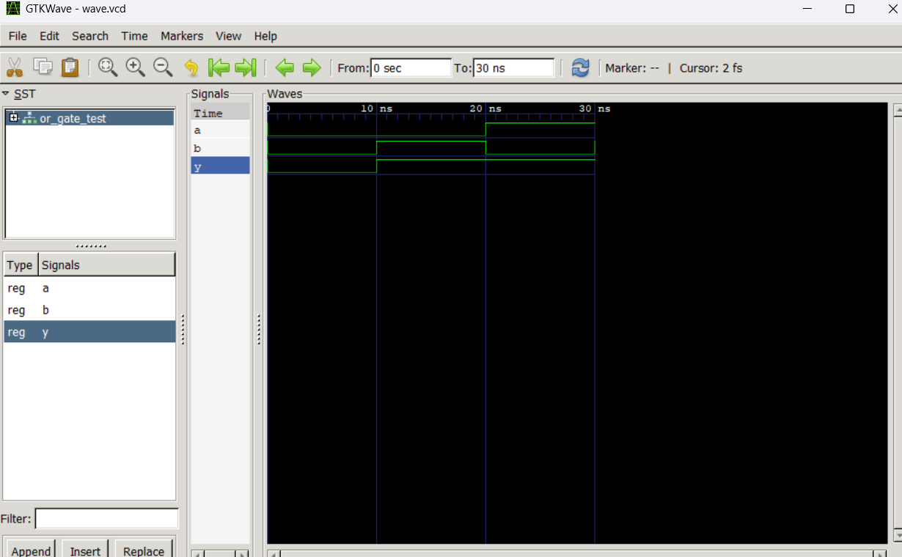
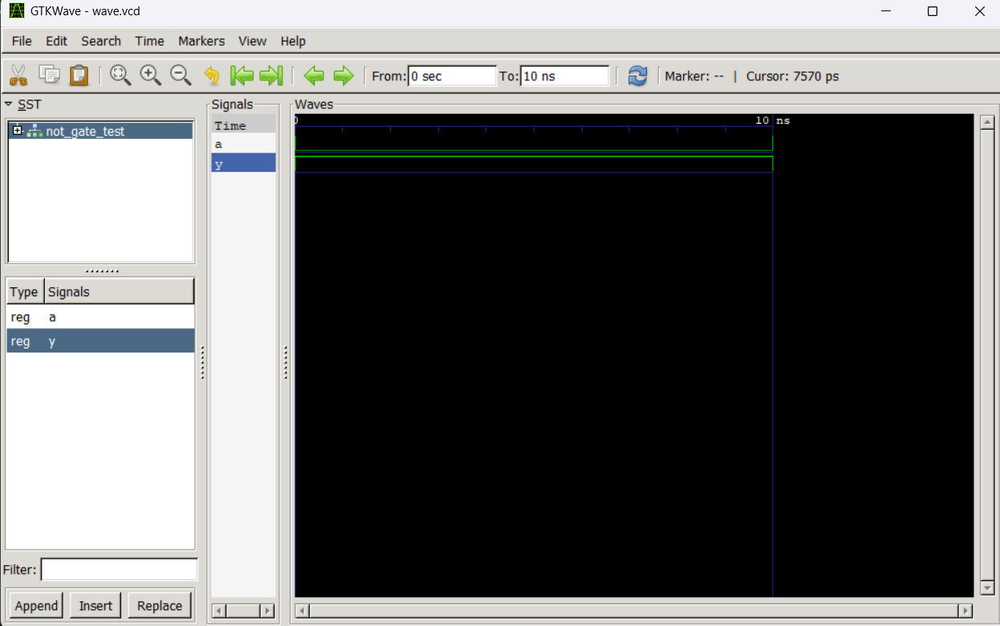
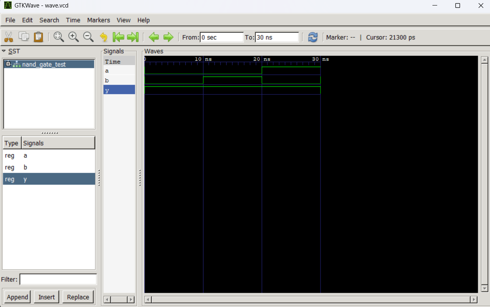
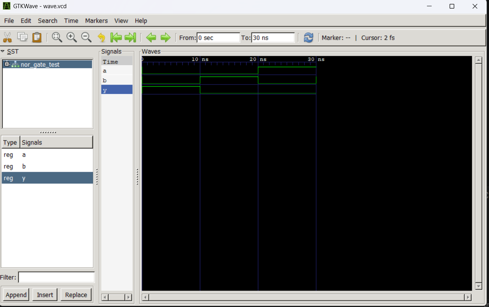
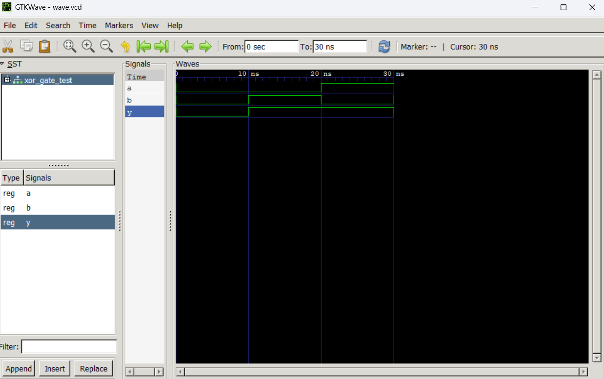
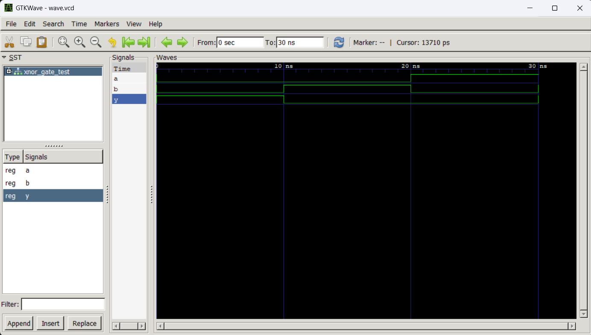

# LAB 2: Realization of Basic Logic Gates using VHDL

This laboratory covers the design, implementation, and simulation of basic digital logic gates (AND, OR, NOT, NAND, NOR, XOR, XNOR) using **VHDL**. The functionality of each gate is verified through testbenches and signal waveforms in an open-source simulation environment.

---

## Objective

- To design and implement basic logic gates (AND, OR, NOT, NAND, NOR, XOR, XNOR) using VHDL.
- To verify the functionality of each gate using VHDL testbenches.
- To compile and simulate the designs using **GHDL** and view the output waveforms using **GTKWave**.

---

## Theory & Truth Tables

Logic gates are the fundamental building blocks of digital electronic circuits. Each gate performs a specific logical operation on its inputs.

### 1. AND Gate
The output $Y$ is high (`'1'`) only if both inputs $A$ and $B$ are high.
$$\text{Logic expression: } Y = A \cdot B$$

| Input A | Input B | Output Y |
|:-------:|:-------:|:--------:|
|    0    |    0    |    0     |
|    0    |    1    |    0     |
|    1    |    0    |    0     |
|    1    |    1    |    1     |

### 2. OR Gate
The output $Y$ is high if at least one input is high.
$$\text{Logic expression: } Y = A + B$$

| Input A | Input B | Output Y |
|:-------:|:-------:|:--------:|
|    0    |    0    |    0     |
|    0    |    1    |    1     |
|    1    |    0    |    1     |
|    1    |    1    |    1     |

### 3. NOT Gate
The output $Y$ is the inverse of the input $A$.
$$\text{Logic expression: } Y = \bar{A}$$

| Input A | Output Y |
|:-------:|:--------:|
|    0    |    1     |
|    1    |    0     |

### 4. NAND Gate
The output $Y$ is low (`'0'`) only if both inputs are high. It is the complement of the AND gate.
$$\text{Logic expression: } Y = \overline{A \cdot B}$$

| Input A | Input B | Output Y |
|:-------:|:-------:|:--------:|
|    0    |    0    |    1     |
|    0    |    1    |    1     |
|    1    |    0    |    1     |
|    1    |    1    |    0     |

### 5. NOR Gate
The output $Y$ is high only if both inputs are low. It is the complement of the OR gate.
$$\text{Logic expression: } Y = \overline{A + B}$$

| Input A | Input B | Output Y |
|:-------:|:-------:|:--------:|
|    0    |    0    |    1     |
|    0    |    1    |    0     |
|    1    |    0    |    0     |
|    1    |    1    |    0     |

### 6. XOR Gate
The output $Y$ is high if the inputs are different.
$$\text{Logic expression: } Y = A \oplus B$$

| Input A | Input B | Output Y |
|:-------:|:-------:|:--------:|
|    0    |    0    |    0     |
|    0    |    1    |    1     |
|    1    |    0    |    1     |
|    1    |    1    |    0     |

### 7. XNOR Gate
The output $Y$ is high if the inputs are identical. It is the complement of the XOR gate.
$$\text{Logic expression: } Y = \overline{A \oplus B}$$

| Input A | Input B | Output Y |
|:-------:|:-------:|:--------:|
|    0    |    0    |    1     |
|    0    |    1    |    0     |
|    1    |    0    |    0     |
|    1    |    1    |    1     |

---

## Software Used

- **VHDL** – Hardware Description Language
- **GHDL** – Open-source VHDL compiler & simulator
- **GTKWave** – Waveform viewer for VCD files
- **Visual Studio Code (VS Code)** – Code editor

---

## Project Structure & Files

Each logic gate is organized into its own subfolder containing the design code, testbench, simulation waveform, and simulation screenshot.

| Directory | Design File | Testbench File | Waveform File | Screenshot |
|:---|:---|:---|:---|:---|
| [`and_gate`](and_gate) | [and_gate.vhdl](and_gate/and_gate.vhdl) | [and_gate_test.vhdl](and_gate/and_gate_test.vhdl) | [wave.vcd](and_gate/wave.vcd) |  |
| [`or_gate`](or_gate) | [or_gate.vhdl](or_gate/or_gate.vhdl) | [or_gate_test.vhdl](or_gate/or_gate_test.vhdl) | [wave.vcd](or_gate/wave.vcd) |  |
| [`not_gate`](not_gate) | [not_gate.vhdl](not_gate/not_gate.vhdl) | [not_gate_test.vhdl](not_gate/not_gate_test.vhdl) | [wave.vcd](not_gate/wave.vcd) |  |
| [`nand_gate`](nand_gate) | [nand_gate.vhdl](nand_gate/nand_gate.vhdl) | [nand_gate_test.vhdl](nand_gate/nand_gate_test.vhdl) | [wave.vcd](nand_gate/wave.vcd) |  |
| [`nor_gate`](nor_gate) | [nor_gate.vhdl](nor_gate/nor_gate.vhdl) | [nor_gate_test.vhdl](nor_gate/nor_gate_test.vhdl) | [wave.vcd](nor_gate/wave.vcd) |  |
| [`xor_gate`](xor_gate) | [xor_gate.vhdl](xor_gate/xor_gate.vhdl) | [xor_gate_test.vhdl](xor_gate/xor_gate_test.vhdl) | [wave.vcd](xor_gate/wave.vcd) |  |
| [`xnor_gate`](xnor_gate) | [xnor_gate.vhdl](xnor_gate/xnor_gate.vhdl) | [xnor_gate_test.vhdl](xnor_gate/xnor_gate_test.vhdl) | [wave.vcd](xnor_gate/wave.vcd) |  |

---

## VHDL Design & Testbench Codes

Below are the VHDL source codes and testbenches for each logic gate.

### 1. AND Gate
* **Design:** `and_gate/and_gate.vhdl`
```vhdl
entity and_gate is
    port (
        A : in bit;
        B : in bit;
        Y : out bit
    );
end and_gate;

architecture behavior of and_gate is
    signal temp : bit;   -- internal signal
begin
    temp <= A and B;
    Y <= temp;
end behavior;
```
* **Testbench:** `and_gate/and_gate_test.vhdl`
```vhdl
entity and_gate_test is
end and_gate_test;

architecture test of and_gate_test is
    signal A, B, Y : bit;
    component and_gate
        port (
            A : in bit;
            B : in bit;
            Y : out bit
        );
    end component;
begin
    uut: and_gate port map (
        A => A,
        B => B,
        Y => Y
    );

    process
    begin
        A <= '0'; B <= '0'; wait for 10 ns;
        A <= '0'; B <= '1'; wait for 10 ns;
        A <= '1'; B <= '0'; wait for 10 ns;
        A <= '1'; B <= '1'; wait for 10 ns;
        wait;
    end process;
end test;
```

---

### 2. OR Gate
* **Design:** `or_gate/or_gate.vhdl`
```vhdl
entity or_gate is
    port (
        A : in bit;
        B : in bit;
        Y : out bit
    );
end or_gate;

architecture behavior of or_gate is
begin
    Y <= A or B;
end behavior;
```
* **Testbench:** `or_gate/or_gate_test.vhdl`
```vhdl
entity or_gate_test is
end or_gate_test;

architecture test of or_gate_test is
    signal A, B, Y : bit;
    component or_gate
        port (
            A : in bit;
            B : in bit;
            Y : out bit
        );
    end component;
begin
    uut: or_gate port map (
        A => A,
        B => B,
        Y => Y
    );

    process
    begin
        A <= '0'; B <= '0'; wait for 10 ns;
        A <= '0'; B <= '1'; wait for 10 ns;
        A <= '1'; B <= '0'; wait for 10 ns;
        A <= '1'; B <= '1'; wait for 10 ns;
        wait;
    end process;
end test;
```

---

### 3. NOT Gate
* **Design:** `not_gate/not_gate.vhdl`
```vhdl
entity not_gate is
    port (
        A : in bit;
        Y : out bit
    );
end not_gate;

architecture behavior of not_gate is
begin
    Y <= not A;
end behavior;
```
* **Testbench:** `not_gate/not_gate_test.vhdl`
```vhdl
entity not_gate_test is
end not_gate_test;

architecture test of not_gate_test is
    signal A, Y : bit;
    component not_gate
        port (
            A : in bit;
            Y : out bit
        );
    end component;
begin
    uut: not_gate port map (
        A => A,
        Y => Y
    );

    process
    begin
        A <= '0'; wait for 10 ns;
        A <= '1'; wait for 10 ns;
        wait;
    end process;
end test;
```

---

### 4. NAND Gate
* **Design:** `nand_gate/nand_gate.vhdl`
```vhdl
entity nand_gate is
    port (
        A : in bit;
        B : in bit;
        Y : out bit
    );
end nand_gate;

architecture behavior of nand_gate is
begin
    Y <= not (A and B);
end behavior;
```
* **Testbench:** `nand_gate/nand_gate_test.vhdl`
```vhdl
entity nand_gate_test is
end nand_gate_test;

architecture test of nand_gate_test is
    signal A, B, Y : bit;
    component nand_gate
        port (
            A : in bit;
            B : in bit;
            Y : out bit
        );
    end component;
begin
    uut: nand_gate port map (
        A => A,
        B => B,
        Y => Y
    );

    process
    begin
        A <= '0'; B <= '0'; wait for 10 ns;
        A <= '0'; B <= '1'; wait for 10 ns;
        A <= '1'; B <= '0'; wait for 10 ns;
        A <= '1'; B <= '1'; wait for 10 ns;
        wait;
    end process;
end test;
```

---

### 5. NOR Gate
* **Design:** `nor_gate/nor_gate.vhdl`
```vhdl
entity nor_gate is
    port (
        A : in bit;
        B : in bit;
        Y : out bit
    );
end nor_gate;

architecture behavior of nor_gate is
begin
    Y <= not (A or B);
end behavior;
```
* **Testbench:** `nor_gate/nor_gate_test.vhdl`
```vhdl
entity nor_gate_test is
end nor_gate_test;

architecture test of nor_gate_test is
    signal A, B, Y : bit;
    component nor_gate
        port (
            A : in bit;
            B : in bit;
            Y : out bit
        );
    end component;
begin
    uut: nor_gate port map (
        A => A,
        B => B,
        Y => Y
    );

    process
    begin
        A <= '0'; B <= '0'; wait for 10 ns;
        A <= '0'; B <= '1'; wait for 10 ns;
        A <= '1'; B <= '0'; wait for 10 ns;
        A <= '1'; B <= '1'; wait for 10 ns;
        wait;
    end process;
end test;
```

---

### 6. XOR Gate
* **Design:** `xor_gate/xor_gate.vhdl`
```vhdl
entity xor_gate is
    port (
        A : in bit;
        B : in bit;
        Y : out bit
    );
end xor_gate;

architecture behavior of xor_gate is
begin
    Y <= A xor B;
end behavior;
```
* **Testbench:** `xor_gate/xor_gate_test.vhdl`
```vhdl
entity xor_gate_test is
end xor_gate_test;

architecture test of xor_gate_test is
    signal A, B, Y : bit;
    component xor_gate
        port (
            A : in bit;
            B : in bit;
            Y : out bit
        );
    end component;
begin
    uut: xor_gate port map (
        A => A,
        B => B,
        Y => Y
    );

    process
    begin
        A <= '0'; B <= '0'; wait for 10 ns;
        A <= '0'; B <= '1'; wait for 10 ns;
        A <= '1'; B <= '0'; wait for 10 ns;
        A <= '1'; B <= '1'; wait for 10 ns;
        wait;
    end process;
end test;
```

---

### 7. XNOR Gate
* **Design:** `xnor_gate/xnor_gate.vhdl`
```vhdl
entity xnor_gate is
    port (
        A : in bit;
        B : in bit;
        Y : out bit
    );
end xnor_gate;

architecture behavior of xnor_gate is
begin
    Y <= not (A xor B);
end behavior;
```
* **Testbench:** `xnor_gate/xnor_gate_test.vhdl`
```vhdl
entity xnor_gate_test is
end xnor_gate_test;

architecture test of xnor_gate_test is
    signal A, B, Y : bit;
    component xnor_gate
        port (
            A : in bit;
            B : in bit;
            Y : out bit
        );
    end component;
begin
    uut: xnor_gate port map (
        A => A,
        B => B,
        Y => Y
    );

    process
    begin
        A <= '0'; B <= '0'; wait for 10 ns;
        A <= '0'; B <= '1'; wait for 10 ns;
        A <= '1'; B <= '0'; wait for 10 ns;
        A <= '1'; B <= '1'; wait for 10 ns;
        wait;
    end process;
end test;
```

---

## How to Run the Simulations

You can compile and simulate each gate using **GHDL** in your command line. First, navigate to the folder of the specific gate you want to simulate:

### E.g., For AND Gate:
```bash
cd and_gate
ghdl -a and_gate.vhdl and_gate_test.vhdl
ghdl -e and_gate_test
ghdl -r and_gate_test --vcd=wave.vcd
gtkwave wave.vcd
```

Follow the same pattern for any other gate:
1. `cd <gate_folder>`
2. `ghdl -a <gate_folder>.vhdl <gate_folder>_test.vhdl`
3. `ghdl -e <gate_folder>_test`
4. `ghdl -r <gate_folder>_test --vcd=wave.vcd`
5. `gtkwave wave.vcd`

---

## Conclusion

In this laboratory, VHDL designs for all seven fundamental logic gates (AND, OR, NOT, NAND, NOR, XOR, XNOR) were successfully created. The operation of each gate was verified by simulating its respective testbench with GHDL, showing exact alignment with the truth tables in GTKWave waveforms.

---

> **Course:** Computer Architecture Lab  
> **Experiment:** Lab 2 – Realization of Basic Logic Gates using VHDL
