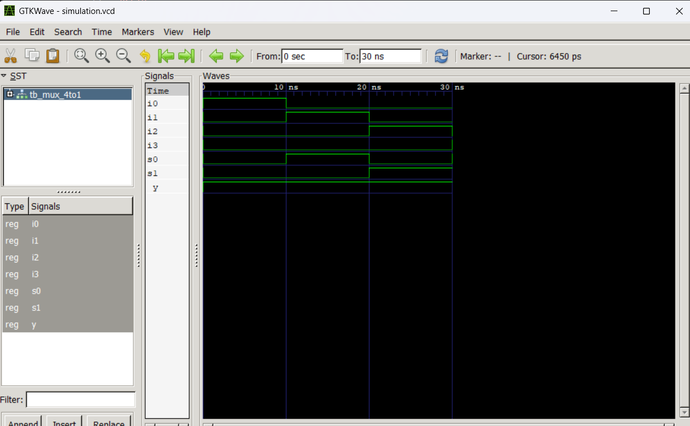
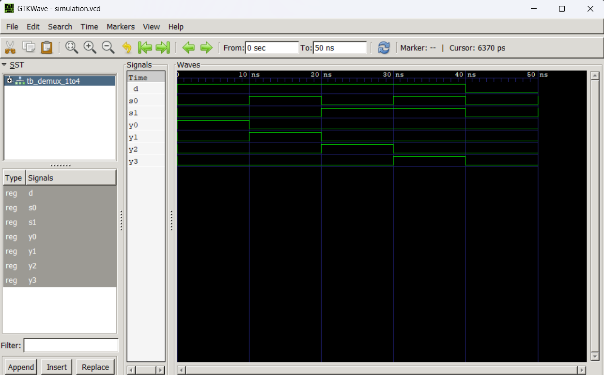

# LAB 4: VHDL Code for Multiplexer and Demultiplexer

This laboratory covers the design, implementation, and simulation of combinational logic circuits—specifically a **4-to-1 Multiplexer (MUX)** and a **1-to-4 Demultiplexer (DEMUX)**—using **VHDL**. The behavior of these circuits is verified through testbenches and signal waveforms in an open-source simulation environment.

---

## Objective

- To understand the operation of multiplexers and demultiplexers.
- To design and implement a 4-to-1 Multiplexer and a 1-to-4 Demultiplexer using VHDL.
- To simulate these combinational circuits using **GHDL** and verify their operation.
- To analyze simulation waveforms using **GTKWave**.

---

## Theory & Truth Tables

Combinational circuits are digital circuits whose outputs depend solely on the current inputs. Unlike sequential circuits, they contain no memory elements (such as flip-flops) and do not require clock signals.

### 1. 4-to-1 Multiplexer (MUX)
A multiplexer is a combinational circuit that selects one of many input signals and routes it to a single output line. The selection of the input is controlled by a set of select lines.
A 4-to-1 Multiplexer has 4 data inputs ($I_0, I_1, I_2, I_3$), 2 select lines ($S_1, S_0$), and 1 output ($Y$).

#### Truth Table
| Select S1 | Select S0 | Output Y |
|:---------:|:---------:|:--------:|
|     0     |     0     |   $I_0$  |
|     0     |     1     |   $I_1$  |
|     1     |     0     |   $I_2$  |
|     1     |     1     |   $I_3$  |

---

### 2. 1-to-4 Demultiplexer (DEMUX)
A demultiplexer performs the reverse operation of a multiplexer. It takes a single input line and routes it to one of several output lines based on select lines.
A 1-to-4 Demultiplexer has 1 data input ($D$), 2 select lines ($S_1, S_0$), and 4 outputs ($Y_0, Y_1, Y_2, Y_3$).

#### Truth Table
| Select S1 | Select S0 | Output Y3 | Output Y2 | Output Y1 | Output Y0 |
|:---------:|:---------:|:---------:|:---------:|:---------:|:---------:|
|     0     |     0     |     0     |     0     |     0     |    $D$    |
|     0     |     1     |     0     |     0     |    $D$    |     0     |
|     1     |     0     |     0     |    $D$    |     0     |     0     |
|     1     |     1     |    $D$    |     0     |     0     |     0     |

---

## Software Used

- **VHDL** – Hardware Description Language
- **GHDL** – Open-source VHDL compiler & simulator
- **GTKWave** – Waveform viewer for VCD files
- **Visual Studio Code (VS Code)** – Code editor

---

## Project Structure & Files

The files are organized into two main folders for the Multiplexer and Demultiplexer circuits.

| Directory | Design File | Testbench File | Waveform File |
|:---|:---|:---|:---|
| [`mux`](mux) | [mux_4to1.vhd](mux/mux_4to1.vhd) | [tb_mux_4to1.vhd](mux/tb_mux_4to1.vhd) | [simulation.vcd](mux/simulation.vcd) |
| [`demux`](demux) | [demux_1to4.vhd](demux/demux_1to4.vhd) | [tb_demux_1to4.vhd](demux/tb_demux_1to4.vhd) | [simulation.vcd](demux/simulation.vcd) |

---

## VHDL Design & Testbench Codes

### 1. 4-to-1 Multiplexer (MUX)
* **Design:** `mux/mux_4to1.vhd`
```vhdl
library IEEE;
use IEEE.STD_LOGIC_1164.ALL;

entity MUX_4TO1 is
    Port (
        I0  : in  STD_LOGIC;
        I1  : in  STD_LOGIC;
        I2  : in  STD_LOGIC;
        I3  : in  STD_LOGIC;
        S0  : in  STD_LOGIC;
        S1  : in  STD_LOGIC;
        Y   : out STD_LOGIC
    );
end entity MUX_4TO1;

architecture Behavioral of MUX_4TO1 is
begin
    process(I0, I1, I2, I3, S0, S1)
        variable sel : STD_LOGIC_VECTOR(1 downto 0);
    begin
        sel := S1 & S0;
        case sel is
            when "00" =>
                Y <= I0;
            when "01" =>
                Y <= I1;
            when "10" =>
                Y <= I2;
            when "11" =>
                Y <= I3;
            when others =>
                Y <= '0';
        end case;
    end process;
end architecture Behavioral;
```
* **Testbench:** `mux/tb_mux_4to1.vhd`
```vhdl
library IEEE;
use IEEE.STD_LOGIC_1164.ALL;

entity TB_MUX_4TO1 is
end entity TB_MUX_4TO1;

architecture Simulation of TB_MUX_4TO1 is

    signal I0, I1, I2, I3 : STD_LOGIC := '0';
    signal S0, S1         : STD_LOGIC := '0';
    signal Y              : STD_LOGIC;

begin

    DUT : entity work.MUX_4TO1
        port map (
            I0 => I0,
            I1 => I1,
            I2 => I2,
            I3 => I3,
            S0 => S0,
            S1 => S1,
            Y  => Y
        );

    STIMULUS : process
    begin
        -- Test 1
        I0 <= '1'; I1 <= '0'; I2 <= '0'; I3 <= '0';
        S1 <= '0'; S0 <= '0';
        wait for 10 ns;

        -- Test 2
        I0 <= '0'; I1 <= '1'; I2 <= '0'; I3 <= '0';
        S1 <= '0'; S0 <= '1';
        wait for 10 ns;

        -- Test 3
        I0 <= '0'; I1 <= '0'; I2 <= '1'; I3 <= '0';
        S1 <= '1'; S0 <= '0';
        wait for 10 ns;

        -- Test 4
        I0 <= '0'; I1 <= '0'; I2 <= '0'; I3 <= '1';
        S1 <= '1'; S0 <= '1';
        wait for 10 ns;

        wait;
    end process STIMULUS;

end architecture Simulation;
```

* **Simulation Waveform:**
  

---

### 2. 1-to-4 Demultiplexer (DEMUX)
* **Design:** `demux/demux_1to4.vhd`
```vhdl
library IEEE;
use IEEE.STD_LOGIC_1164.ALL;

entity DEMUX_1TO4 is
    Port (
        D  : in  STD_LOGIC;
        S0 : in  STD_LOGIC;
        S1 : in  STD_LOGIC;
        Y0 : out STD_LOGIC;
        Y1 : out STD_LOGIC;
        Y2 : out STD_LOGIC;
        Y3 : out STD_LOGIC
    );
end entity DEMUX_1TO4;

architecture Behavioral of DEMUX_1TO4 is
begin
    process(D, S0, S1)
        variable sel : STD_LOGIC_VECTOR(1 downto 0);
    begin
        -- Default outputs
        Y0 <= '0';
        Y1 <= '0';
        Y2 <= '0';
        Y3 <= '0';

        sel := S1 & S0;
        case sel is
            when "00" =>
                Y0 <= D;
            when "01" =>
                Y1 <= D;
            when "10" =>
                Y2 <= D;
            when "11" =>
                Y3 <= D;
            when others =>
                null;
        end case;
    end process;
end architecture Behavioral;
```
* **Testbench:** `demux/tb_demux_1to4.vhd`
```vhdl
library IEEE;
use IEEE.STD_LOGIC_1164.ALL;

entity TB_DEMUX_1TO4 is
end entity TB_DEMUX_1TO4;

architecture Simulation of TB_DEMUX_1TO4 is

    signal D  : STD_LOGIC := '0';
    signal S0 : STD_LOGIC := '0';
    signal S1 : STD_LOGIC := '0';
    signal Y0 : STD_LOGIC;
    signal Y1 : STD_LOGIC;
    signal Y2 : STD_LOGIC;
    signal Y3 : STD_LOGIC;

begin

    DUT : entity work.DEMUX_1TO4
        port map (
            D  => D,
            S0 => S0,
            S1 => S1,
            Y0 => Y0,
            Y1 => Y1,
            Y2 => Y2,
            Y3 => Y3
        );

    STIMULUS : process
    begin
        -- Test with input D = '1'
        D <= '1';
        
        -- Route to Y0 (S1 S0 = "00")
        S1 <= '0'; S0 <= '0'; wait for 10 ns;

        -- Route to Y1 (S1 S0 = "01")
        S1 <= '0'; S0 <= '1'; wait for 10 ns;

        -- Route to Y2 (S1 S0 = "10")
        S1 <= '1'; S0 <= '0'; wait for 10 ns;

        -- Route to Y3 (S1 S0 = "11")
        S1 <= '1'; S0 <= '1'; wait for 10 ns;

        -- Test with input D = '0'
        D <= '0';
        S1 <= '0'; S0 <= '0'; wait for 10 ns;
        S1 <= '1'; S0 <= '1'; wait for 10 ns;

        wait;
    end process STIMULUS;

end architecture Simulation;
```

* **Simulation Waveform:**
  

---

## How to Run the Simulations

You can compile and simulate both circuits using **GHDL** and inspect the waveforms using **GTKWave**.

### E.g., For 4-to-1 Multiplexer (MUX):
```bash
cd mux
ghdl -a mux_4to1.vhd tb_mux_4to1.vhd
ghdl -e TB_MUX_4TO1
ghdl -r TB_MUX_4TO1 --vcd=simulation.vcd
gtkwave simulation.vcd
```

### E.g., For 1-to-4 Demultiplexer (DEMUX):
```bash
cd demux
ghdl -a demux_1to4.vhd tb_demux_1to4.vhd
ghdl -e TB_DEMUX_1TO4
ghdl -r TB_DEMUX_1TO4 --vcd=simulation.vcd
gtkwave simulation.vcd
```

---

## Discussion

In this experiment, a 4-to-1 Multiplexer and a 1-to-4 Demultiplexer were successfully designed using VHDL and simulated using GHDL. The designs utilize behavioral modeling with a process and case statement to implement selection logic.

A compiler warning regarding overloading of the concatenation operator (`&`) on `STD_LOGIC` inputs in GHDL was resolved by declaring a process variable `sel` of type `STD_LOGIC_VECTOR(1 downto 0)`. This variable explicitly holds the concatenated value before evaluating the case statement.

The testbenches successfully verified both circuits. The simulation waveforms observed in GTKWave demonstrated exact alignment with the theoretical truth tables of the multiplexer and demultiplexer.

---

## Conclusion

The multiplexer and demultiplexer circuits were successfully implemented and simulated using VHDL. The simulation results matched the expected logic functions for all selector input combinations. This experiment enhanced our understanding of routing logic circuits and verified VHDL design flows utilizing variables, concatenation, and case statements.

---

> **Course:** Computer Architecture Lab  
> **Experiment:** Lab 4 – VHDL Code for Multiplexer and Demultiplexer
