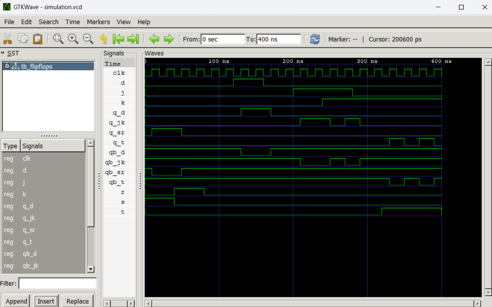

# LAB 7: VHDL Code for Sequential Circuits (SR, D, JK, and T Flip-Flops)

This laboratory covers the design, implementation, and simulation of sequential logic circuits—specifically the four fundamental flip-flops: **SR Flip-Flop**, **D Flip-Flop**, **JK Flip-Flop**, and **T Flip-Flop**—using **VHDL**. The behavior of these flip-flops is verified through a unified testbench and signal waveforms.

---

## Objective

- To design and implement fundamental flip-flops (SR, D, JK, and T) using behavioral VHDL modeling.
- To verify their functional correctness using a unified VHDL testbench (`tb_flipflops.vhd`).
- To compile and simulate the designs using **GHDL** and generate simulation waveform files.

---

## Theory & Truth Tables

Sequential circuits are digital circuits whose outputs depend not only on the current inputs but also on past histories (state). They use memory elements (flip-flops) controlled by a clock signal (`CLK`).

### 1. SR Flip-Flop (Set-Reset)
The SR flip-flop has two control inputs: $S$ (Set) and $R$ (Reset). The combination $S=1, R=1$ is forbidden because it leads to an undefined state.

#### Truth Table (Rising Edge of Clock)
| S | R | $Q_{next}$ | Description |
|:-:|:-:|:----------:|:------------|
| 0 | 0 |    $Q$     | Hold State  |
| 0 | 1 |     0      | Reset State |
| 1 | 0 |     1      | Set State   |
| 1 | 1 | Undefined  | Forbidden   |

---

### 2. D Flip-Flop (Data/Delay)
The D flip-flop captures the value of the input $D$ at the active clock edge and outputs it as $Q$. It delays the input signal by one clock cycle.

#### Truth Table (Rising Edge of Clock)
| D | $Q_{next}$ | Description |
|:-:|:----------:|:------------|
| 0 |     0      | Reset State |
| 1 |     1      | Set State   |

---

### 3. JK Flip-Flop
The JK flip-flop improves on the SR flip-flop by eliminating the forbidden state. When $J=1$ and $K=1$, the output toggles (inverts).

#### Truth Table (Rising Edge of Clock)
| J | K | $Q_{next}$ | Description  |
|:-:|:-:|:----------:|:-------------|
| 0 | 0 |    $Q$     | Hold State   |
| 0 | 1 |     0      | Reset State  |
| 1 | 0 |     1      | Set State    |
| 1 | 1 |  $\bar{Q}$ | Toggle State |

---

### 4. T Flip-Flop (Toggle)
The T flip-flop has a single input $T$. When $T=1$, the output toggles on the active clock edge; when $T=0$, the output holds its current value.

#### Truth Table (Rising Edge of Clock)
| T | $Q_{next}$ | Description  |
|:-:|:----------:|:-------------|
| 0 |    $Q$     | Hold State   |
| 1 |  $\bar{Q}$ | Toggle State |

---

## Project Structure & Files

All files are located in the `LAB7` directory:

| Filename | Description |
|:---|:---|
| [sr_ff.vhd](sr_ff.vhd) | VHDL design of the SR Flip-Flop. |
| [d_ff.vhd](d_ff.vhd) | VHDL design of the D Flip-Flop. |
| [jk_ff.vhd](jk_ff.vhd) | VHDL design of the JK Flip-Flop. |
| [t_ff.vhd](t_ff.vhd) | VHDL design of the T Flip-Flop. |
| [tb_flipflops.vhd](tb_flipflops.vhd) | Unified testbench for simulating all four flip-flops simultaneously. |
| [simulation.vcd](simulation.vcd) | Generated Value Change Dump (VCD) waveform file. |

---

## Compilation & Simulation Instructions

1. Open PowerShell or Bash inside the `LAB7` folder:
   ```powershell
   cd LAB7
   ```

2. Compile/Analyze all flip-flop source files and the testbench:
   ```powershell
   ghdl -a sr_ff.vhd d_ff.vhd jk_ff.vhd t_ff.vhd tb_flipflops.vhd
   ```

3. Elaborate the testbench entity:
   ```powershell
   ghdl -e TB_FLIPFLOPS
   ```

4. Run the simulation (set a stop time since the clock generator runs indefinitely):
   ```powershell
   ghdl -r TB_FLIPFLOPS --vcd=simulation.vcd --stop-time=500ns
   ```

5. View the waveform using GTKWave:
   ```powershell
    gtkwave simulation.vcd
    ```

---

## Simulation Waveform


