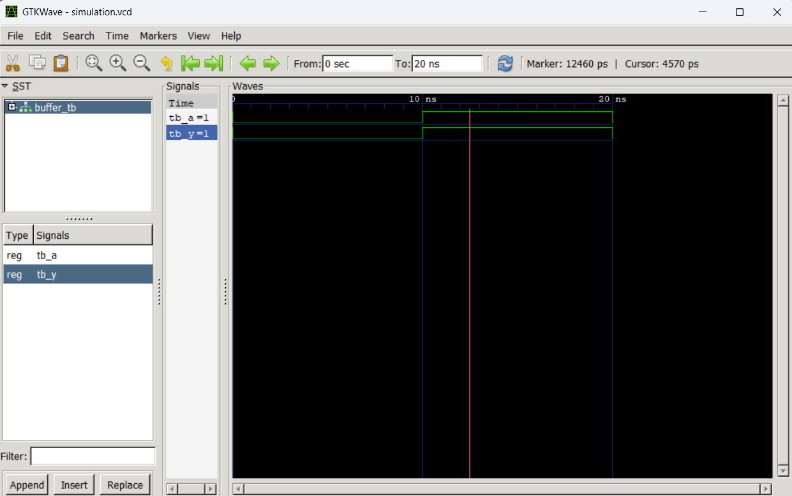
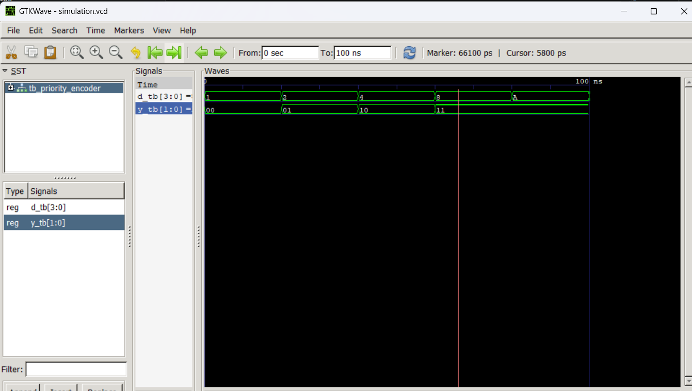
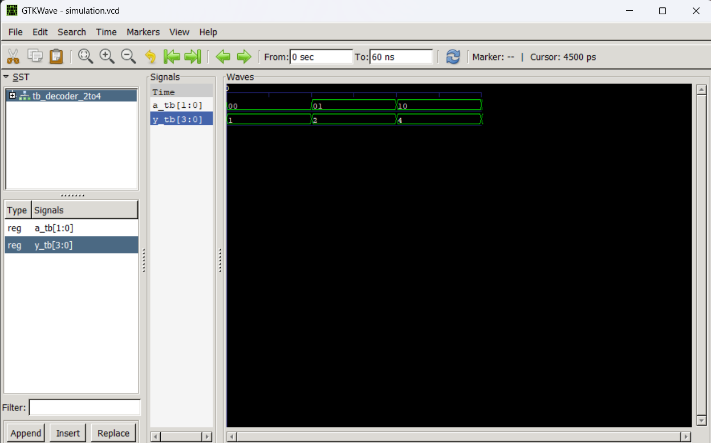
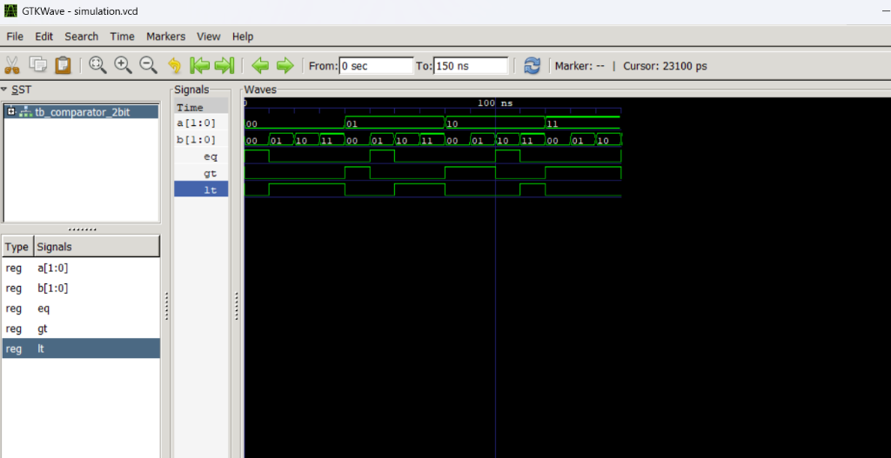
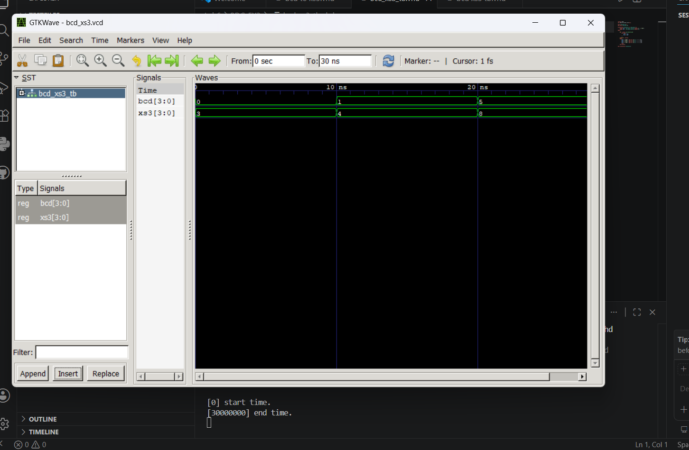
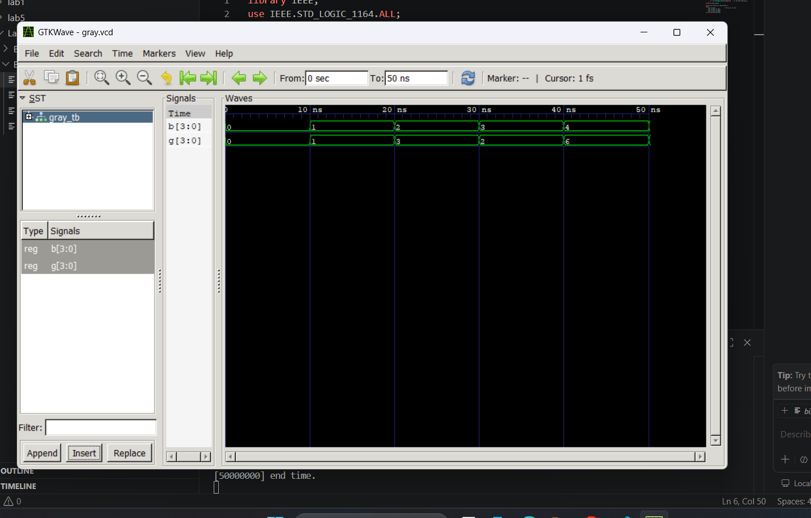

# Computer Architecture Lab - VHDL Laboratory Works

Welcome to the **Computer Architecture Lab** repository. This workspace contains the complete design, implementation, simulation, and verification of various combinational logic gates and modules using **VHDL** (VHSIC Hardware Description Language).

All designs are compiled and simulated using the open-source **GHDL** toolchain, and waveforms are analyzed using **GTKWave**.

---

## Laboratory Directory Structure

Each lab is structured in its own directory with design files (`.vhd`), testbenches, simulation wave results (`.vcd`), and detailed readme documentation:

| Lab Index | Experiment Name | Key Components | Directory Link |
|:---:|:---|:---|:---|
| **Lab 1** | Introduction to VHDL | Buffer (`MY_BUFFER`) | [`Lab-01-Introduction-to-VHDL`](Lab-01-Introduction-to-VHDL) |
| **Lab 2** | Realizing Basic Logic Gates | AND, OR, NOT, NAND, NOR, XOR, XNOR Gates | [`LAB2`](LAB2) |
| **Lab 3** | Combinational Circuits | 4-to-2 Priority Encoder & 2-to-4 Decoder | [`LAB3`](LAB3) |
| **Lab 4** | Routing Combinational Circuits | 4-to-1 Multiplexer & 1-to-4 Demultiplexer | [`LAB4`](LAB4) |
| **Lab 5** | Arithmetic Combinational Circuits | 2-bit Magnitude Comparator | [`LAB5`](LAB5) |
| **Lab 6** | Code Converters | BCD-to-Excess-3 & Binary-to-Gray | [`Lab6`](Lab6) |

---

## Software Stack & Environment Setup

The following tools were used to compile and verify all designs:
1. **GHDL Compiler** – Analyzes (`-a`), elaborates (`-e`), and runs (`-r`) VHDL source code.
2. **GTKWave Analyzer** – Displays the generated `.vcd` (Value Change Dump) waveform files.
3. **VS Code** – Main text editor and repository manager.

### How to Compile & Run any Lab:
1. Open PowerShell or Bash in the respective lab folder.
2. Compile the design and testbench files:
   ```bash
   ghdl -a design_file.vhd tb_file.vhd
   ```
3. Elaborate the testbench entity:
   ```bash
   ghdl -e TB_ENTITY_NAME
   ```
4. Run the simulation to output the waveform file:
   ```bash
   ghdl -r TB_ENTITY_NAME --vcd=simulation.vcd
   ```
5. View waveforms:
   ```bash
   gtkwave simulation.vcd
   ```

---

## Detailed Experiments

### Lab 1: Introduction to VHDL (Buffer)
* **Objective:** Learn VHDL design entry, library instantiation, and testbench structures by implementing a one-input, one-output buffer.
* **VHDL Design Code ([buffer.vhd](Lab-01-Introduction-to-VHDL/buffer.vhd)):**
  ```vhdl
  library IEEE;
  use IEEE.STD_LOGIC_1164.ALL;

  entity MY_BUFFER is
      Port (
          A : in  STD_LOGIC;
          Y : out STD_LOGIC
      );
  end entity MY_BUFFER;

  architecture Dataflow of MY_BUFFER is
  begin
      Y <= A;
  end architecture Dataflow;
  ```
* **Testbench Code ([tb_buffer.vhd](Lab-01-Introduction-to-VHDL/tb_buffer.vhd)):**
  ```vhdl
  library IEEE;
  use IEEE.STD_LOGIC_1164.ALL;

  entity BUFFER_TB is
  end entity BUFFER_TB;

  architecture Simulation of BUFFER_TB is
      signal tb_A : STD_LOGIC := '0';
      signal tb_Y : STD_LOGIC;
  begin
      DUT : entity work.MY_BUFFER
          port map (
              A => tb_A,
              Y => tb_Y
          );

      STIMULUS : process
      begin
          tb_A <= '0'; wait for 10 ns;
          tb_A <= '1'; wait for 10 ns;
          tb_A <= '0'; wait for 10 ns;
          wait;
      end process STIMULUS;
  end architecture Simulation;
  ```
* **Simulation Result Waveform:**
  

---

### Lab 2: Realizing Basic Logic Gates
* **Objective:** Design basic logic gates using `bit` primitives and verify their truth tables.
* **Gates Source Codes ([LAB2](LAB2)):**
  * **AND Gate:** `Y <= A and B;`
  * **OR Gate:** `Y <= A or B;`
  * **NOT Gate:** `Y <= not A;`
  * **NAND Gate:** `Y <= not (A and B);`
  * **NOR Gate:** `Y <= not (A or B);`
  * **XOR Gate:** `Y <= A xor B;`
  * **XNOR Gate:** `Y <= not (A xor B);`
* **Example Code - AND Gate ([and_gate.vhdl](LAB2/and_gate/and_gate.vhdl)):**
  ```vhdl
  entity and_gate is
      port (
          A : in bit;
          B : in bit;
          Y : out bit
      );
  end and_gate;

  architecture behavior of and_gate is
      signal temp : bit;
  begin
      temp <= A and B;
      Y <= temp;
  end behavior;
  ```
* **AND Gate Testbench ([and_gate_test.vhdl](LAB2/and_gate/and_gate_test.vhdl)):**
  ```vhdl
  entity and_gate_test is
  end and_gate_test;

  architecture test of and_gate_test is
      signal A, B, Y : bit;
      component and_gate
          port (
              A : in bit;
              B : in bit;
              Y : out bit
          );
      end component;
  begin
      uut: and_gate port map (A => A, B => B, Y => Y);
      process
      begin
          A <= '0'; B <= '0'; wait for 10 ns;
          A <= '0'; B <= '1'; wait for 10 ns;
          A <= '1'; B <= '0'; wait for 10 ns;
          A <= '1'; B <= '1'; wait for 10 ns;
          wait;
      end process;
  end test;
  ```
* **Simulation Result Waveform (AND Gate):**
  

---

### Lab 3: Combinational Circuits (Encoder & Decoder)
* **Objective:** Implement a 4-to-2 Priority Encoder (resolving multi-active input issues by assigning highest priority to $D_3$) and a 2-to-4 Decoder.
* **4-to-2 Priority Encoder Design ([priority_encoder.vhd](LAB3/Encoder/priority_encoder.vhd)):**
  ```vhdl
  library IEEE;
  use IEEE.STD_LOGIC_1164.ALL;

  entity PRIORITY_ENCODER is
      Port (
          D : in STD_LOGIC_VECTOR(3 downto 0);
          Y : out STD_LOGIC_VECTOR(1 downto 0)
      );
  end PRIORITY_ENCODER;

  architecture Behavioral of PRIORITY_ENCODER is
  begin
      process(D)
      begin
          if D(3) = '1' then
              Y <= "11";
          elsif D(2) = '1' then
              Y <= "10";
          elsif D(1) = '1' then
              Y <= "01";
          elsif D(0) = '1' then
              Y <= "00";
          else
              Y <= "00";
          end if;
      end process;
  end Behavioral;
  ```
* **2-to-4 Decoder Design ([decoder_2to4.vhd](LAB3/De-Coder/decoder_2to4.vhd)):**
  ```vhdl
  library IEEE;
  use IEEE.STD_LOGIC_1164.ALL;

  entity DECODER_2TO4 is
      Port (
          A : in STD_LOGIC_VECTOR(1 downto 0);
          Y : out STD_LOGIC_VECTOR(3 downto 0)
      );
  end DECODER_2TO4;

  architecture Behavioral of DECODER_2TO4 is
  begin
      process(A)
      begin
          case A is
              when "00" => Y <= "0001";
              when "01" => Y <= "0010";
              when "10" => Y <= "0100";
              when "11" => Y <= "1000";
              when others => Y <= "0000";
          end case;
      end process;
  end Behavioral;
  ```
* **Simulation Waveforms:**
  * **Priority Encoder:**
    
  * **Decoder:**
    

---

### Lab 4: Multiplexer & Demultiplexer
* **Objective:** Design routing combinational circuits: a 4-to-1 Multiplexer (selecting 1 of 4 inputs to route to output) and a 1-to-4 Demultiplexer (routing 1 input to 1 of 4 outputs).
* **4-to-1 Multiplexer Design ([mux_4to1.vhd](LAB4/mux/mux_4to1.vhd)):**
  ```vhdl
  library IEEE;
  use IEEE.STD_LOGIC_1164.ALL;

  entity MUX_4TO1 is
      Port (
          I0  : in  STD_LOGIC;
          I1  : in  STD_LOGIC;
          I2  : in  STD_LOGIC;
          I3  : in  STD_LOGIC;
          S0  : in  STD_LOGIC;
          S1  : in  STD_LOGIC;
          Y   : out STD_LOGIC
      );
  end entity MUX_4TO1;

  architecture Behavioral of MUX_4TO1 is
  begin
      process(I0, I1, I2, I3, S0, S1)
          variable sel : STD_LOGIC_VECTOR(1 downto 0);
      begin
          sel := S1 & S0;
          case sel is
              when "00" => Y <= I0;
              when "01" => Y <= I1;
              when "10" => Y <= I2;
              when "11" => Y <= I3;
              when others => Y <= '0';
          end case;
      end process;
  end architecture Behavioral;
  ```
* **1-to-4 Demultiplexer Design ([demux_1to4.vhd](LAB4/demux/demux_1to4.vhd)):**
  ```vhdl
  library IEEE;
  use IEEE.STD_LOGIC_1164.ALL;

  entity DEMUX_1TO4 is
      Port (
          D  : in  STD_LOGIC;
          S0 : in  STD_LOGIC;
          S1 : in  STD_LOGIC;
          Y0 : out STD_LOGIC;
          Y1 : out STD_LOGIC;
          Y2 : out STD_LOGIC;
          Y3 : out STD_LOGIC
      );
  end entity DEMUX_1TO4;

  architecture Behavioral of DEMUX_1TO4 is
  begin
      process(D, S0, S1)
          variable sel : STD_LOGIC_VECTOR(1 downto 0);
      begin
          Y0 <= '0'; Y1 <= '0'; Y2 <= '0'; Y3 <= '0'; -- Defaults
          sel := S1 & S0;
          case sel is
              when "00" => Y0 <= D;
              when "01" => Y1 <= D;
              when "10" => Y2 <= D;
              when "11" => Y3 <= D;
              when others => null;
          end case;
      end process;
  end architecture Behavioral;
  ```

---

### Lab 5: 2-bit Magnitude Comparator
* **Objective:** Design an arithmetic combinational logic module to compare two 2-bit inputs ($A$ and $B$) and indicate whether $A = B$ ($EQ$), $A > B$ ($GT$), or $A < B$ ($LT$).
* **2-bit Magnitude Comparator Design ([comparator_2bit.vhd](LAB5/comparator_2bit.vhd)):**
  ```vhdl
library IEEE;
use IEEE.STD_LOGIC_1164.ALL;

entity COMPARATOR_2BIT is
    Port (
        A  : in  STD_LOGIC_VECTOR(1 downto 0);
        B  : in  STD_LOGIC_VECTOR(1 downto 0);
        EQ : out STD_LOGIC;
        GT : out STD_LOGIC;
        LT : out STD_LOGIC
    );
end entity COMPARATOR_2BIT;

architecture Dataflow of COMPARATOR_2BIT is
begin

    -- Equal (XNOR checks equality)
    EQ <= (A(1) xnor B(1)) and
          (A(0) xnor B(0));

    -- Greater Than
    GT <= (A(1) and (not B(1))) or
          ((A(1) xnor B(1)) and A(0) and (not B(0)));

    -- Less Than
    LT <= ((not A(1)) and B(1)) or
          ((A(1) xnor B(1)) and (not A(0)) and B(0));

end architecture Dataflow;
  ```
* **Testbench Code ([tb_comparator_2bit.vhd](LAB5/tb_comparator_2bit.vhd)):**
  ```vhdl
library IEEE;
use IEEE.STD_LOGIC_1164.ALL;

entity TB_COMPARATOR_2BIT is
end entity TB_COMPARATOR_2BIT;

architecture Simulation of TB_COMPARATOR_2BIT is

    signal A  : STD_LOGIC_VECTOR(1 downto 0) := "00";
    signal B  : STD_LOGIC_VECTOR(1 downto 0) := "00";
    signal EQ : STD_LOGIC;
    signal GT : STD_LOGIC;
    signal LT : STD_LOGIC;

begin

    DUT : entity work.COMPARATOR_2BIT
        port map (
            A  => A,
            B  => B,
            EQ => EQ,
            GT => GT,
            LT => LT
        );

    STIMULUS : process
    begin

        -- A = B
        A <= "00"; B <= "00"; wait for 10 ns;

        -- A > B
        A <= "01"; B <= "00"; wait for 10 ns;

        -- A < B
        A <= "00"; B <= "01"; wait for 10 ns;

        -- A < B
        A <= "10"; B <= "11"; wait for 10 ns;

        -- A > B
        A <= "11"; B <= "10"; wait for 10 ns;

        -- A = B
        A <= "11"; B <= "11"; wait for 10 ns;

        wait;

    end process;

end architecture Simulation;
  ```
* **Simulation Result Waveform:**
  

---

### Lab 6: Code Converters
* **Objective:** Design combinational logic converter modules: a BCD to Excess-3 Converter and a 4-bit Binary to Gray Code Converter.
* **BCD to Excess-3 Converter Design ([bcd_to_xs3.vhd](Lab6/BDC_EX3/bcd_to_xs3.vhd)):**
  ```vhdl
  library IEEE;
  use IEEE.STD_LOGIC_1164.ALL;
  use IEEE.NUMERIC_STD.ALL;

  entity BCD_TO_XS3 is
      port (
          BCD : in  std_logic_vector(3 downto 0); -- BCD input (0-9)
          XS3 : out std_logic_vector(3 downto 0)  -- Excess-3 output
      );
  end entity BCD_TO_XS3;

  architecture Behavioral of BCD_TO_XS3 is
  begin
      process(BCD)
      begin
          XS3 <= std_logic_vector(unsigned(BCD) + 3);
      end process;
  end architecture Behavioral;
  ```
* **Binary to Gray Code Converter Design ([bin_to_gray.vhd](Lab6/BIN_GRAY/bin_to_gray.vhd)):**
  ```vhdl
  library IEEE;
  use IEEE.STD_LOGIC_1164.ALL;

  entity BIN_TO_GRAY is
      port (
          B : in std_logic_vector(3 downto 0);   -- 4 -bit binary input
          G : out std_logic_vector(3 downto 0)   -- 4 -bit Gray code output
      );
  end entity BIN_TO_GRAY;

  architecture Dataflow of BIN_TO_GRAY is
  begin
      G(3) <= B(3);               -- MSB stays the same
      G(2) <= B(3) xor B(2);
      G(1) <= B(2) xor B(1);
      G(0) <= B(1) xor B(0);
  end architecture Dataflow;
  ```
* **Simulation Result Waveforms:**
  * **BCD to Excess-3 Converter:**
    
  * **Binary to Gray Code Converter:**
    

---

## Conclusion & Learnings
Across these six laboratory exercises, the foundational flow of digital system design and hardware description using VHDL was fully explored:
1. **Behavioral vs. Dataflow Design:** Utilized both behavioral constructs (like `case` statements, variable concatenation, and sequential `if` branches inside `process` blocks) and direct dataflow models.
2. **Standard and Numeric Libraries:** Transitioned from basic `bit` operations (Lab 2) to standard multi-level logic `std_logic` and arithmetic logic types (`unsigned` from `IEEE.NUMERIC_STD`) in magnitude comparison.
3. **Simulation-Based Verification:** Established robust testbenches to assert the logical functions of combinational modules, confirming outputs against the mathematical truth tables through GTKWave inspection.
4. **Code Conversions:** Explored representation mapping in BCD-to-Excess-3 arithmetic conversions and binary-to-Gray data encoding logic.

